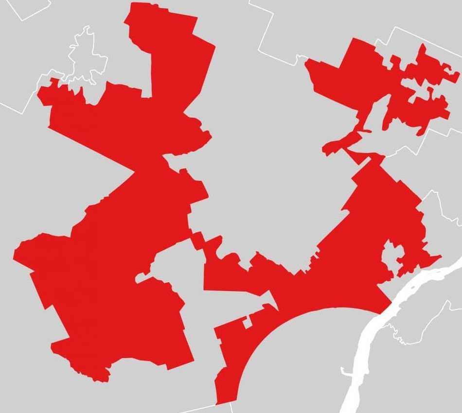
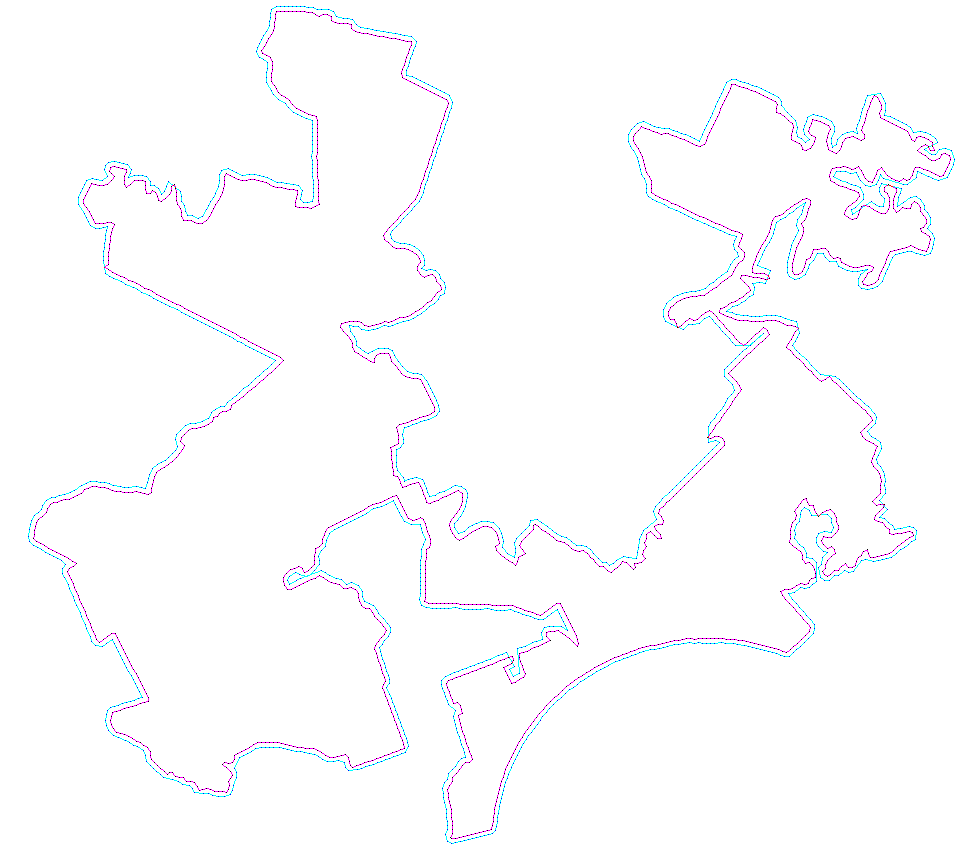
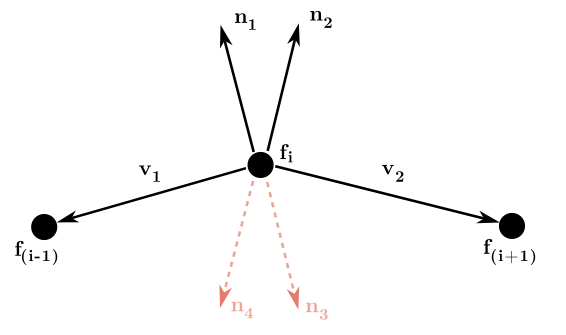

# Image To Mesh
## Goal & summary
This project takes in an image and creates a mesh from it that can be used for 3D modeling or 3D printing. The core problem that this project solves is the creation of a a regular offset mesh for an irregular shape, of arbitrary thickness, optimized for 3D printing. With this project, you can take a complex shape, for example an image of a gerrymandered district, and convert it into a .obj file where the sides have an offset thickness. This would allow your district image to be 3D printed to make a cookie cutter, or wall art, or overyly complicated pencil holder. A more direct application of this is for tolerance between complex geometry parts modeled after images. For example if you wanted to take an arbitrary image and emboss it into paper, you would need a "hole" and a "punch" with some tolerance offset between them that follows the shape of the image and accounts for both the print tolerance and the paper thickness.

## Showcase Images
### Smiley Test Example Holepunch Pipeline
Input Image:

Marking Groups:

Border Identification and Uniform Reduction:

Output Point Representation:

Output OBJ:

### Testing Image
Input Image:

Output Point representation:

### Gerrymandering Test (Goofy Kicking Donald)
Input Image:

Output Representation:

## Algorithm Flow
An image is taken in and processed to identify core connected groups (flood fill algorithm), the borders of these groups are then identified and uniformly reduced to create a set of points along the border of the shape. The proper order of the points for the creation of mesh faces is determined. The normal vectors to these faces are found and new vertices created along both outside normal vectors from each corner. This gives a set of new points, which are processed by the algorithm to order them and collapse them into one point (depending on whether the corner is convex or concave and a distance merging factor). This set of new points is then processed further to generate an extrusion mesh. They are then used to create an OBJ file according to the final form that is desired (hole and punch, cookie cutter, etc.)

Creation of offset points:

## Image Processing
The program starts by taking in an image, it converts the image to black and white (by which I do not mean greyscale, but that every pixel is either black or white) based on a value if the average value of the RGB values of the pixel falls below, the pixel is considered black. We only care about the black pixels. We then do a flood fill algorithm on the image to identify a group ID number for each black pixel (white pixels have a group ID number of None). Then we find the border pixels of each group. This processing gives us the following 2D arrays in which the data for a particular pixel at coordiantes (x,y) is held:
- pixel_array - 2D array pixel_array[y][x] yeilds True if there is a black pixel at (x,y), False if not
- groupID_array - 2D array pixel_array[y][x] yeilds yeilds the group ID of a pixel at (x,y), None if there is not black pixel there
- boundary_pixels - 2D array boundary_pixels[y][x] yeilds True if there (x,y) has a boundary pixel, False if not
- points_by_group - a python list that holds groups, each group is a list of coordinate values
- bounary_points_by_group - a python list that holds lists of boundary pixels for each group

All of this processing is done with numpy arrays, which make the program much faster than if we used python's lists

Now, we want to uniformly reduce the boundary points for each group. This is because with large images, we'd get an overly complicated mesh thats hard to work with, diffiuclt to process, and would be especially difficult to manually adjust. To do this uniform reduction, we use a reduction factor (stored in 'reduction_factor' variable), which is number between 0 and 1 (except we actually set it's lower bound at 0.01 so we don't get absurdly high skip numbers or a divide by 0 error). If the reduction factor is 0.5 or less, obtain a skip index by 1/reduction_factor, going through the list of boundary points, every 1/reduction_factor points, we don't add the point in question to the new list of reduced boundary points. For example a reduction_factor of 0.25 would yeild 4 (ie. 1/0.25) as a skip index. meaning that going through the list, we eliminate every 4th point, yielding a new list of boundary points that is reduced by 25% (or 1/4th). If the reduction factor is greater than 0.5, we get a skip index of 1/(1-reduction_factor) and then instead of deleting a point every skip_index points through the list, we delete every point and spare each point at a multiple of skip_index.

Using this approach on the boundary_points_by_group point groups, does not produce uniform reduction in points. When saving test images, there could be long runs of points that had not been reduced at all and big gaps where too many had been reduced in one spot (ie. the point density was not preserved). This is because the points aren't in an order such that adjacent points are adjacent in the list, instead, their order is a result of the way the flood fill algorithm touched them. My first instinct was to use the sorted() function on the groups of boundary points before going through so that they'd be in order of (x,y) with priority on x values (ie. sorted by their x value and then their y value). But this also produces non-uniform reduction. My next thought was sorting the points based on their euclidean distance from the origin. This approach works better, but is still not completely uniform. The solution that worked was building a new list by doing a flood fill like algorithm on each border group, starting at a random point in the group. The flood fill had to be slightly modified to check in all eight possible point positions around the current point.

The good thing is that now that we've sorted the points such that points close to eachother are next to eachother, this property is preserved after the uniform reduction of points. So the reduced_boundaries list of boundary groups has points next to eachother that are next to eachother, this will be advantageous for the creation faces when we make the mesh. 

## Mesh creation
### What is an OBJ file?
This program will turn the image into a .obj file. For reference, see the [wikipedia page](https://en.wikipedia.org/wiki/Wavefront_.obj_file) for .obj files. Some main points of information about obj files that will be useful to understand this program are:
- a vertex is specified via a line starting with the letter v, followed by (x,y,z) coordinate
    - note that you can leave z coordinate blank and it assumes 0 when it's being read
- a face is defined by a line starting with the letter f, followed by a list of vertex_index/texture_index/normal_index
    - note that you can just define in terms of vertex_index (eg. f 1 2 3 4 would make a face using the 1st, 2nd, 3rd, and 4th vertices you define in the file, with edges in that order)
- comments in an obj file are preceded by a # character (just like python)

### creating faces based on the image
The mesh creation process is to go through each point in a group, add it to the obj file as a vertex, store the vertex index of that point and then go through the boundary points and add them as face (producing an n-gon face using the points in the group). The problem is that while the points in reduced_boundares are sorted enough (because it came from a reduction of sorted_boundary_points), they aren't completely sorted. They were mostly sorted, sorted enough that the reduction process was uniform enough. But the problem is the face creation from a boundary point list, making the face with just one vertex out of order could ruin the geometry of the mesh and obscure the shape we are trying to represent. The problem now is how do we efficiently sort points such that points next to eachother on the border are next to eachother in the list. This is essentially the same problem as before (but now it's slightly different because we know that most of the points that should be next to eachother on the boundary are next to eachother in the list). We could use a brute force algorithm goes through each point and calculates the two closest points to it on the boundary and makes sure that it's situated betweeen both of those points in the list (if not, then it inserts itself where it needs to be). However, this would be computationally expensive, becuase for each point in the border you'd have to check all the other points, yielding O(n^n) complexity, which is (in a word) poo-poo. Instead, we'll take advantage of the fact that the list is mostly in the order we want already. This algorgithm (preformed by the 'relocate_points()' function in the code) is described below:
- we calculate the average distance between two adjacent points in the list
    - this will serve as a benchmark by which to measure the points in the list. points that are out of place, will be more likely to have a distance to their neighbor higher than the benchmark 
    - may also want to consider using the distance based on the skip_index (assuming the points in the list are directly adjacent before reduction, which is not an unfair assumption)
- go through each point in the list, get the distance to the next point, compare the distance to the benchmark, if the distance and benchmark values are off by some margin, then take that next point and insert it into the list where it should go (ie. the position where it has the smallest distance between itself and its two neighbors.)
    - because the list is already mostly correct, most of the points we relocate will actually be out of place. with fine tuning of benchmark calculation and margin, we should be able to get good preformance.

### Extending the mesh (simple)
Once you have the points in order, extending the mesh to make the image 3D is pretty trivial, all you do is copy the faces we already made for each group, with an offset z-value. After this, we simply make a face with each point in the list, the next point in the list, and the two corresponding points on the offset face (the last point in the list wraps around to make a face with the first point in the list).

### Creating an offset
If you want to give the borders of your shape thickness (eg. you're making a cookie cutter based on an image), we need to offset the boundary points. These offset points could also be used as the back face of the mesh to give a tapering structure (which might be useful in 3D printing so you don't have to deal with sharp overhangs of >80 degrees). Another example where this might be useful would be if you're making a "punch" and a "socket" to recieve that punch and fit that shape inside, you can't have it be the exact same shape inverted because after printing (becuase of print tolerances) they won't fit together; there needs to be a gap. Before discussing how to get offset points, it's important that we understand how to get a vector perpindicular to a given 2D vector: given a vector v=<x,y>, the vector perpendicular to that vector will be <-y,x> and <y,-x>, in 2D there are only two possible directions so one of these normals will be in one direction and the other in the opposite direction (these will have same magnitude as origional vector). Each point on the boundary can have 4 possible offset normals, given by finding the 2 possible orthogonal vectors to the vector between the current point and the previous point on the boundary and the vector between the current point and the next one one the boundary. We then divide these normal vectors by their magnitude, to get unit normal vectors, which we can multiply by a chosen scalar to get any offset distance we want. If traversing the points on the boundary of a shape in the counterclockwise direction, the <-y,x> normal vector gives the outside normal vector (ie the normal vector that points outside, instead of inside), where <x,y> is the vector from a point to the next point on the boundary (in the counterclockwise direction). To get the best offset border shape, that correctly encompasses the original shape, we use both ousied normal vectors (ie. at each point on the boundary we get the normal outside normal vector to the vector from the current point to the previous point and the current point to the next point). This approach does double the number of points involved, so to limit the number of points we have to deal with, we'll only keep both of these points if they turn out to be a non-negligible distance away from eachother (which is determined based on a if their distance from eachother is higher than some percentage of the offset length; this percentage is stored in 'offset_point_distance_proportion' in the code, i've had success with a value of 0.3 --future me here and I think higher is better for this; currently I like 0.75). The offset length ('offset_scalar' in the code) is a scalar that we multiply to the unit normal vector of a point when adding the vector to the point to determine the offset point (ie. the new point on the offset boundary).  
- Note: We use the Shapely.geometry library to determine which normals point inside and which point outside the shape by getting the 4 normal points and checking to see if they are contained by the polygon the original boundary points create
We call the 'relocate_points()' function on the offset boundary points list to identify and relocate any points that aren't in the right order on the border.
- Note: Depending on the shape you're trying to render, the offset_point_distance_proportion, if set too low, may result in you getting some vertex pairs that are out of order in the boundary list. This is the out of order point relocation algorithm (stored in the function 'relocate_points()') only reorders points whose distance to its neighbors is over the average distance and if the points are out of order and too close together (which would result from the offset_point_distance_proportion being too low), they won't get flagged and subsequently their order won't be fixed.

Once we have all the offset points making an expanded boundary in the correct order, we can easily make a face with them and extrude them to give the mesh depth, creating a recepticle

## The problem
So far all we've been working with are solid groups, where each shape in the image is solid. However, if you have negative space inside one of your shapes (ie. white pixels surrounded entirely by black pixels, for example a donut shape), we quickly run into a problem with the appraoch we've been using. The first problem is that we lose all of the inner boundary points when doing the flood fill to get the boundary pixels in order because there is no way to reach them from wherever we start. The solution to this was to have a list of points on the boundary that we had yet to visit and continue doing the flood fill until that list was empty, and if the stack became empty, start again by adding a new starting point from the list. This made it such that the sorted_boundary_points contains all the points in a contiguous boundary (ie. it's no longer where each sub list is a group, but instead each sub list is a unique boundary). This means that we can have bounary point groups that fall inside of others.

To store these in a way that makes sense, we use a tree, where if a boundary point group falls inside of another, it becomes subordinate to that group. I used the anytree library to do this and created a wrapper class called 'Boundary' that holds the points that make up a boundary and the shapely Polygon object that those points create. The list 'group_trees' starts with every boundary as a root node, but we go through the list and any boundary that has a point inside of another boundary's polygon becomes a child of the ladder. Except it's not that simple, what if we have multiple levels of nesting (eg. a bullseye shape)? If a boundary falls inside another boundary, we need to go through all of the points in that boundary's tree to insert the boundary in question at the lowest possible point in the hierarchy, such that it is only parent to the boundaries it contians and subordinate to every boundary that contains it. Then we go through 'group_trees' and delete every node that's not a root node.

Now we need to deconstruct these trees in a way that's helpful. Each shape we want to convert either will have just an outer boundary and a filled in center or an outer boundary and an inner boundary; there can be nesting of these shapes, but the shapes are what we need to focus on. We deconstruct this tree such that all shapes with just an outer boundary (ie. the shape doesn't have any negative space) are root nodes and all 2-boundary shapes are trees with a height of 1 (nb. just a root node is said to have a height of 0).

After we've deconstructed these trees to where they are only outer boundaries with children (being inner boundaries) and no grandchildren, we can go about generating the mesh. If we have just an outer boundary (ie. the node doesn't have any children), we can simply fill in the shape with an n-gon as we had done previously. However, it gets more complicated when we have holes in the shape. We create a polygon object whose boundary is defined by the outer boundary and whose holes are defined by all the boundaries of the children, we can then use the triangulate() function to triangulate the shape and break it up into all of it's constituent faces (as 3 points is the minimum required to define a face). This results in triangle faces outside of the polygon and inside of where the hole should be (ie. where we don't want them), but this can be resolved by ignoring triangles that overlap with the polygon created by the inner boundaries and don't overlap with the polygon created by the outer boundary. 

To create the offset boundary, we need to create offset boundary points for both the outer boundary and all the inner boundaries. Doing the outer boundary follows the same process as before and the inner boundary follows that process but instead of checking to ensure that the points don't fall inside the polygon created by the boundary (ie the outer boundary), we check to make sure that the points fall inside the boundary (ie. the inner boundary), for each of those inner boundaries. 

An additional problem that arose was if you have a vertex that is concave (ie. it bites into the shape we create), the normal points that it produces will be out of order and as such got traversed and created out of order, creating problems with mesh generation. To solve this, I wrote a function that determines whether a point is concave; this works by eliminating the point from the boundary list, creating a new polygon with that list, then determining if the point we eliminated falls inside that new polygon, if it does, we have a convex point and we have to reverse the order we traverse the normals we get from it, if not (ie. the point is convex), we're fine and we can traverse as usual. A similar logic was applied for the boundaries of holes. 

With the offset boundaries, both outer and inner, having been created, we apply a similar extrusion process to make the socket that receives the main geometry. 

## Coming back to this project to finish everything up
So the biggest sustaining problem with the way everything above left this project was that the extruded borders were not clean. The first problem that I identified was that the logic was actualy backwards and we were condensing candidate points only if they were below the threshold of offset_scalar*offset_point_distance_proportion (instead of above), so I fixed that and made it such that instead of picking one of the candidate points to collapse to, it would choose the midpoint of the two. This cleared up the extruded points on parts of the mesh that were predominantly straight, however there was still a problem in the corners. This problem arose from the fact that points in the most concave parts of the corners of the origional points were making offset points that were too close to other origional points and this was making weird little loops and cuts and suuuuper ugly offset mesh. The solution to this that I implemented was to not add any candidate point that was too close to an existing origional point. This was implemented with the is_point_collision() function (which takes a point and radius arguments), which returns True if there is a point on the origional mesh within a raidus of the inputted point. The radius of what's too close is determined by the offset_scalar\*offset_point_distance_proportion, or it'll be 1.5 if that number is smaller than 1.5 --the theory with making the minimum value of the raidus being 1.5 is that this distance will capture all the points in the 8 adjacent neighbors (but not farther) because the corner neighbors will have a distance of sqrt(2)=1.41, which is just under 1.5. This solution produced a much more acceptable extrusion mesh!

I modified the part of the code that initially gets the border pixels in order to work more accurately. The way the code had worked previously was that it added points next to the point most recently taken from the stack to the stack with preference for edges then corners. However, the problem was that if the border touched itself, there were two directions it could proceed in and it was a crap chute whether it'd pick the right one. The solution I found was to consider points around the current point in a consistent clockwise manner and only consider proceeding to the next point if the current and the next point shared white space (calculated with the check_space_adjacency(pt1, pt2) fucntion). Additionally I added a break statement to continue the choosing from stack loop after one possible next candidate is found so it doesn't double (or more) add to the stack for one point. 

The next problem was that the extrusion would cut sharp corners and cut into the origional mesh. The solution implemented was a line detection to function to see when this was happening, implemented with the is_line_collisions(pt1, pt2) function, whcih returns true if the line between the two inputted points crosses the border of the origional mesh. The offset mesh cutting into the origional mesh for 2 primary reasons: (1) The corner is too sharp and the offset points along the normal vector don't clear the corner (2) The offset points along the normal vector would create the right geometry, they just need to be scaled out more. The solution to the former is to create a new point at the midpoint of the two points in question and then offset it in the normal direction. The solution to the latter is to extend the offset points out more than the offset scalar distance to see to some limit to see if no collision is created (both points would have to be extended at the same time though, else there would be some pretty bad assymmetries. )

## TODO:
- implement line collision detection between og and offset lines to aid in offset point creation
- figure out a way to order boundary points in a more time efficient manner (also add progress bar for this and other slow parts)
    - i think ordering boundary points is so slow becuase it has to work with whole numpy arrays of the whole image's size, so find a way to deal with collisions not like that and it would be much faster
- do better with point relocation; find a way to identify problem areas in the mesh
    - *****if problem with the boundary pionts being out of order perisists, maybe try: reducing the sorted points by 1/2 (ie. getting rid of every other point) and then iteratively doing the neighbor-distance-based relocation algorithm (becuase there should be a distance of maximum sqrt(2) between adjacent points)****
- see if initial ordering points process can be optimized for efficiency
- find an absolute method to prevent extruded points from being too close to eachother (ie. not just finding midpoint between two candidates for an OG point): could either modify is_point_collision() function or make new function or something else 
- modularize code into callable functions for the expanding of outer borders and inner borders because it's essentially the same process.

- find a better out-of-place point identification and relocation algorithm 
- in reduction algorithm, account for density (ie. boundary-pixel to number-of-pixels-in-group ratio) such that the smaller boundaries don't get too destroyed
- Consider rewriting reduction algorithm to use shapely library's interpolate function (also look into .simplify())
- Use shapely is_ccw function on shapely.LinearRing objects made with boundary points to see if the points are clockwise and if not set them to be clockwise (see also .reverse() method)
    - must first figure out how LinearRing objects work; will just using the points in the list to create them make a closed shape? --> check with .is_closed method
- identify points on the offset boundary that are too close to the origional polygon and fix them
- insert check on any divisions to catch any divide by zero errors
